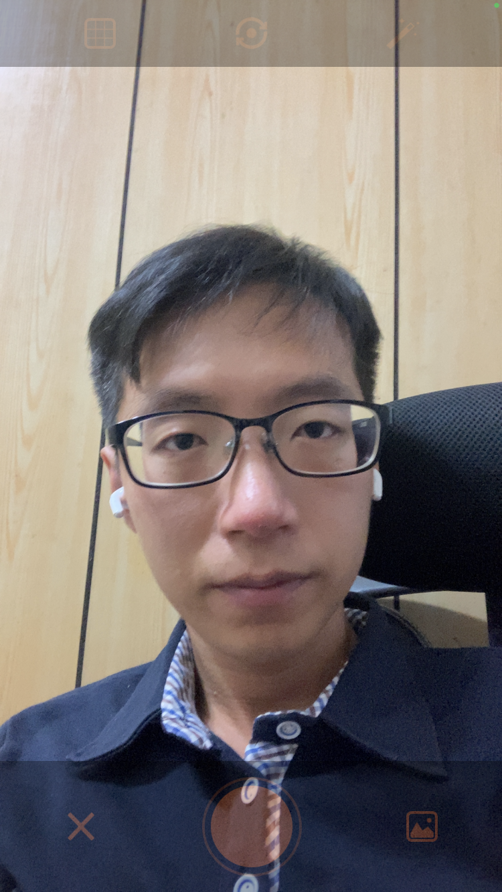
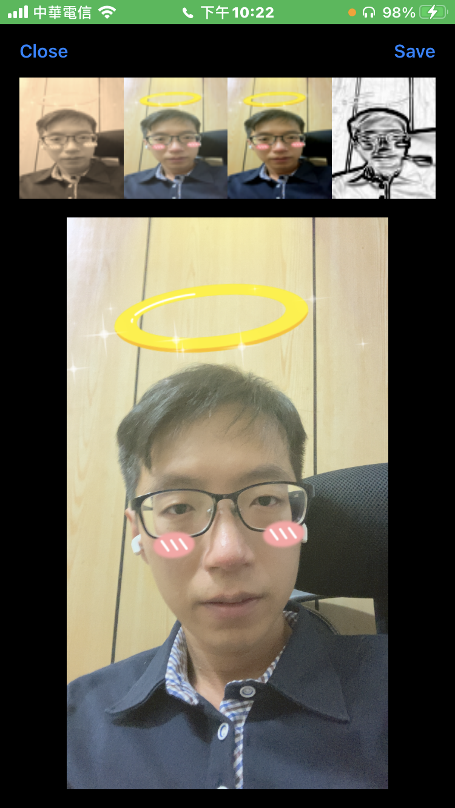
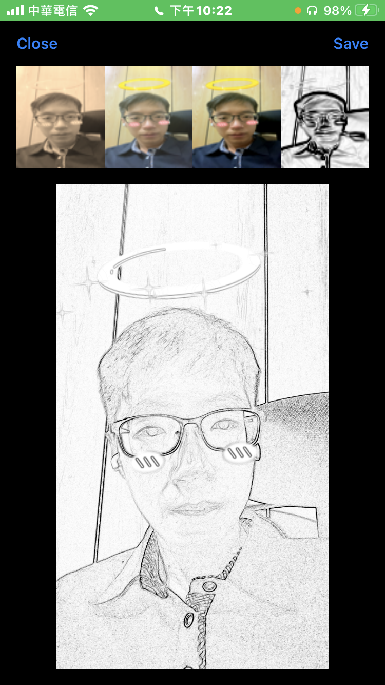
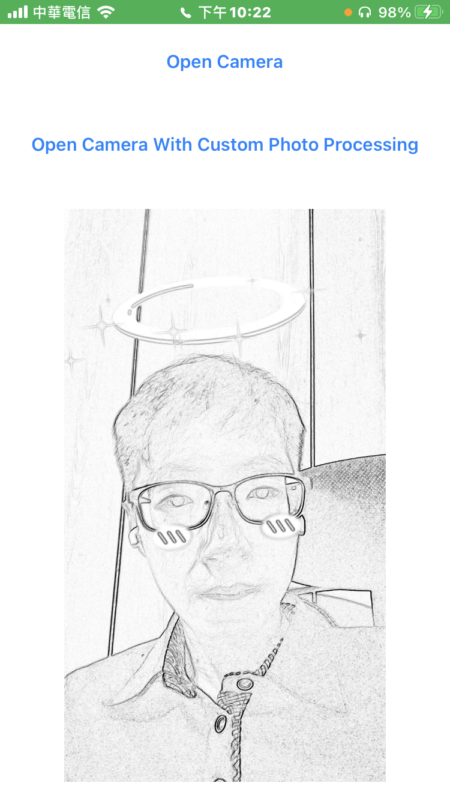

# IREffectCamera 

- IRCameraViewController is a powerful camera view controller use face stickers and filters for iOS.

## Screenshots
| Demo Main Page | Enable Face Sticker |
|:---:|:---:|
||| 
| Confirm | Custom filters |
||| 
| Custom filters | Update display view |
||| 

## Features
-  Camera basic functions.
-  Face stickers and filters

## Technologies
- Camera [IRCameraViewController](https://github.com/irons163/IRCameraViewController).
- Face Stickers [IRCameraSticker](https://github.com/irons163/IRCameraSticker)
- Filters [GPUImage](https://github.com/BradLarson/GPUImage)

## Install
### Git
- Git clone this project.
- Copy this project into your own project.
- Add the .xcodeproj into you  project and link it as embed framework.
#### Options
- You can remove the `demo` and `ScreenShots` folder.

### Cocoapods
- Add `pod 'IREffectCamera'`  in the `Podfile`
- `pod install`

## Usage

### Basic

#### Basic functions
- See [IRCameraViewController](https://github.com/irons163/IRCameraViewController).

#### Face Stickers
- See [IRCameraSticker](https://github.com/irons163/IRCameraSticker).

```obj-c
#import <IRCameraSticker/IRCameraSticker.h>
#import <IRCameraSticker/IRCameraStickerFilter.h>
#import <IRCameraSticker/IRCameraStickersManager.h>

...

- (IBAction)faceStickerTapped {
    [_camera displayFaceSticker];
}
```

### Advanced settings

Custom image filters(You can see how GPUImage work in the demo project):

- Return `YES` by `customizePhotoProcessingView` in the `IRCameraDelegate` to disable the default filters
```obj-c

#pragma mark - IRCameraDelegate

- (BOOL)customizePhotoProcessingView {
    return YES;
}

```

- Deal with the image by your own way:
```obj-c

#import <GPUImage/GPUImage.h>

- (UIImage *)imageWithSketchFilter:(UIImage *)originImage {
    GPUImageFilter *imageFilter = [[GPUImageSketchFilter alloc] init];
    return [imageFilter imageByFilteringImage:originImage];
}

```


